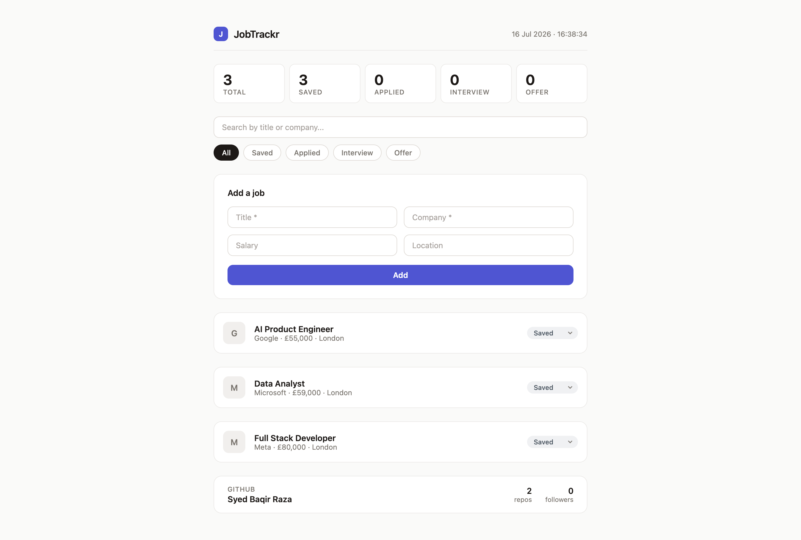

# JobTrackr

A minimal job application tracker for managing your job hunt — search,
filter, and move applications through a pipeline from saved to offer.
Built as part of rebuilding my frontend skills in public.

**Live demo:** https://jobtrackr-flame.vercel.app/



## Features

- Track applications through a four-stage pipeline: Saved → Applied → Interview → Offer
- Live stats row showing counts per stage
- Search by job title or company, combined with status filtering
- Add jobs through a validated form (with visible error feedback)
- Data persists in localStorage — survives refreshes and browser restarts,
  including migration of older saved data when the data model changed
- Fully responsive from 360px up, with zero media queries (CSS grid auto-fit)
- Live GitHub profile card fetched from the GitHub API with proper
  loading and error states

## Tech stack

- **React 18** (hooks: useState, useEffect) + **Vite**
- **Plain CSS** with design tokens (custom properties) no UI libraries,
  deliberately, to demonstrate CSS fundamentals: grid, flexbox, focus
  states, and a styled `<select>` as status badges
- **No backend** — localStorage persistence (a backend + sync is on the roadmap)

## Run locally

```bash
git clone https://github.com/baqirraza5/jobtrackr.git
cd jobtrackr
npm install
npm run dev
```

## What I learned

- **React re-renders only when a state setter is called, nothing else.**
  I proved this to myself by logging renders in the console: a plain
  variable can change forever and the screen never updates, because
  nobody tells React to take a new picture.

- **Immutability isn't a style preference.** `const b = a` copies an
  object's address, not the object. I watched one careless mutation
  change three variables at once. Spread, `map`, and `filter` create new
  data instead, which is exactly what React needs to detect changes.

- **Error handling can hide bugs instead of catching them.** A too-broad
  `catch` block once swallowed a crash in my own code and printed a
  friendly message, everything looked handled while the real bug
  shipped. Now my catch blocks always log the actual error.

- **Changing a data model means migrating data users already have.**
  When I replaced the `applied` boolean with a status pipeline, old
  localStorage data would have broken the app. I learned to upgrade
  stored data on load, and that state has more than one entry point,
  and every one of them must produce the current shape.

- **"No visible difference" doesn't mean "no bug."** I removed a
  useEffect cleanup expecting chaos and saw nothing until I gave each
  interval timer an ID and logged its ticks, revealing orphaned timers
  piling up silently. Choosing what to measure is half of debugging.

- **CSS I'll never forget:** flex children refuse to shrink below their
  content unless you set `min-width: 0` — and `grid-template-columns:
repeat(auto-fit, minmax(...))` can make a layout responsive with zero
  media queries.

## Roadmap

- Notes and application dates per job
- Sort by salary / date added
- TypeScript migration
- Backend with multi-device sync

---

Built by [Syed Baqir Raza](https://github.com/baqirraza5) ·
[LinkedIn](https://linkedin.com/in/thebaqirraza)
